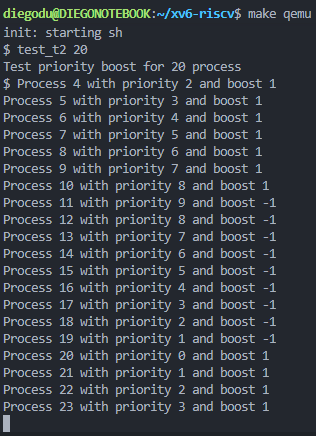

# Informe Tarea N°1
## Sistemas Operativos - Diego Duhalde V.

### Modificaciones realizadas

#### Parte I

Se sigue el hint entregado por el profesor de tomar como base otra llamada, en VSCode se buscan todas las apariciones de `getpid()`.

1. **`syscall.c`:**  
   Se duplican las apariciones de `getpid()` y se cambia a `getppid()`:
   ```c
   extern uint64 sys_getppid(void);
   [SYS_getppid] sys_getppid,
   ```

2. **`syscall.h`:**  
   Se agrega la siguiente línea:
   ```c
   #define SYS_getppid 22
   ```

3. **`sysproc.c`:**  
   Se agrega el siguiente bloque de código, que es el que realiza todo el proceso esperado:
   ```c
   uint64
   sys_getppid(void)
   {
     return myproc()->parent->pid;
   }
   ```

4. **`user.h`:**  
   Se agrega la siguiente línea:
   ```c
   int getppid(void);
   ```

5. **`usys.pl`:**  
   Se agrega la siguiente línea:
   ```c
   entry("getppid");
   ```

6. **`yosoytupadre.c`:**  
   Se crea el archivo `yosoytupadre.c` siguiendo lo especificado en el PDF:
   ```c
   #include "kernel/types.h"
   #include "kernel/stat.h"
   #include "user/user.h"

   int main() {
       printf("Yo soy tu padre - dijo el proceso %d\n", getppid());
       exit(0);
   }
   ```

7. **`Makefile`:**  
   Se agrega la siguiente línea:
   ```makefile
   $U/_yosoytupadre
   ```

#### Parte II

Se realiza el mismo paso a paso mostrado para la parte 2, realizando cambios en el nombre de la funcion a `getancester(int)` y cambios dentro de `sysproc.c` que es donde sucede la "magia" (Todos los pasos no documentados corresponden a seguir el paso a paso de la parte I, pero con cambios de nombre)

1. **`sysproc.c`:**
    Se agrega el siguiente bloque de código, que es el que realiza todo el proceso esperado:
    ```c
    uint64
    sys_getancestor(int n)
    {
        argint(0, &n);
        
        if (n == 0) {
            return myproc()->pid;
        } else if (n == 1) {
            if (myproc()->parent == NULL) {
            return -1;
            }
            return myproc()->parent->pid;
        } else if (n == 2) {
            if (myproc()->parent == NULL || myproc()->parent->parent == NULL) {
            return -1;
            }
            return myproc()->parent->parent->pid;
        } else {
            return -1;
        }
    }
    ```
2. **`ancestro.c`:**
    
    Se crea `ancestro.c` para realizar las pruebas correspondientes al funcionamiento, creando el archivo con el siguiente codigo: 

    ```c
    #include "kernel/types.h"
    #include "kernel/stat.h"
    #include "user/user.h"

    int main(int argc, char *argv[]) {
        if (argc != 2) {
            exit(1);
        }
        
        int pid = atoi(argv[1]);
        printf("Yo soy tu ancestro - dijo el proceso %d\n", getancestor(pid));
        exit(0);
    }
   ```


### Dificultades encontradas

1. **Creación de `sys_getancestor` en `syscall.c`:**  
   Inicialmente, agregué intuitivamente `sys_getancestor` como:
   ```c
   extern uint64 sys_getancestor(int);
   ```
   dado que debía recibir un argumento numérico. Sin embargo, al recibir errores, procedí a cambiarlo a:
   ```c
   extern uint64 sys_getancestor(void);
   ```
   y funcionó sin complicaciones.

2. **Problema con el nombre del ejecutable en la parte 2:**  
   Había creado un ejecutable llamado `yosoytuancestro.c` y lo agregué en el `Makefile`. Sin embargo, tras recibir un error e investigar, descubrí que había un límite de caracteres, y `yosoytuancestro` lo superaba. Decidí renombrarlo a `ancestro.c`.

3. **Manejo de salida en `sys_getancestor` dentro de `sysproc.c`:**  
   Para manejar el caso en el que se pide el abuelo y no existe, utilicé `NULL`, que no viene directamente en C. Por lo tanto, tuve que incluir la siguiente librería:
   ```c
   #include <stddef.h>
   ```
### Funcionamiento de las llamadas
#### 1. Yo soy tu padre (int getppid(void))
Se prueba la funcion en diversas oportunidades, consiguiendo lo mostrado en la imagen.


#### 2. Ancestro (int getancestor(int))
Se prueban los diferentes casos para la función. Inicialmente, se ejecuta sin entregar argumento, por lo que no se recibe ningún output. Luego, se prueba con los siguientes valores:

- **0:** Se obtiene el mismo proceso.
- **1:** Se obtiene el padre.
- **2:** Se obtiene el abuelo.
- **3:** Como se encuentra fuera de nuestro rango, retorna `-1`.

