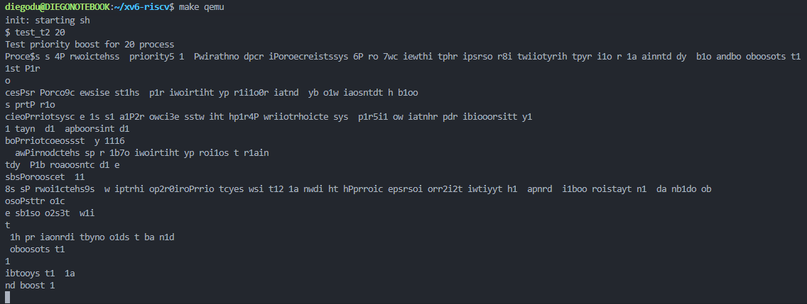
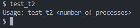

# Informe Tarea N°0
## Sistemas Operativos - Diego Duhalde V.

### Pasos seguidos para instalar (y ejecutar) XV6
#### 1. Instalar WSL
Instale Ubuntu 20.04.6 directamente dentro de Microsoft Store, lo ejecute y cree mi usur y password de Linux.

#### 2. Clonar Repositorio XV6-RISCV
Clone el repositorio original de XV6 directamente desde el GitHub oficial entregado por el profesor.

```bash
git clone https://github.com/mit-pdos/xv6-riscv.git
```

#### 3. Instalar ToolChain
Se instala ToolChain utilizando los siguientes comandos:

```bash
#Se clona el repositorio de toolchain
git clone https://github.com/riscv/riscv-gnu-toolchain
```
```bash
#Se instalan/actualizan los paquetes necesarios
sudo apt-get install autoconf automake autotools-dev curl libmpc-dev libmpfr-dev libgmp-dev gawk build-essential bison flex texinfo gperf libtool patchutils bc zlib1g-dev libexpat-dev
```
```bash
#Se configura y construye toolchain
$ cd riscv-gnu-toolchain
$ ./configure --prefix=/usr/local
$ sudo make
$ cd ..
```
```bash
#Se instala QEMU 8.0.0
$ wget https://download.qemu.org/qemu-8.0.0.tar.xz
$ tar xf qemu-8.0.0.tar.xz
```
```bash
#Se configura y construye QEMU
$ cd qemu-4.1.0
$ ./configure --disable-kvm --disable-werror --prefix=/usr/local
$ make
$ sudo make install
$ cd ..
```

#### 4. Compilar XV6
Para compilar XV6, accedí a la carpeta previamente clonada utilizando el siguiente comando:

```bash
cd xv6-riscv
```

Luego, ejecute el siguiente comando:

```bash
make
```
#### 5. Ejecutar XV6
Para iniciar XV6, utiliza el siguiente comando:

```bash
make qemu
```
Resultando lo siguiente en la consola:


#### 6. Verificar la instalación
Para verificar que la instalación se haya realizado correctamente, ejecuta diversos comandos en la consola.



### Problemas encontrados y soluciones

#### 1. Problemas con toolchain
Al momento de querer instalar toolchain existieron diversos errores, probando 3 vias distintas, en una primera instancia se probo con el primer resultado de Google al buscar toolchain, las cuales se instalaban correctamente, pero no funcionaban para ejecutar XV6, luego se probo con la guia proporcionada por el profesor (https://github.com/johnwinans/riscv-toolchain-install-guide), con el cual se llegaban a errores de instalacion, finalmente se prueba con una guía encontrada en StackOverFlow con la que se consigue exitosamente la instalacion (https://pdos.csail.mit.edu/6.828/2019/tools.html).

#### 2. Problemas con QEMU
En la guia seguida instalaban QEMU 4.1.0, pero al completar todos los pasos se llegaba a que la terminal ejecutaba todo, pero no mostraba nada en consola, se actualizo a la version 7.1.0 llegando al mismo error, para finalmente upgradear a la version 8.0.0 y poder ejecutar todo sin problemas

#### 3. Problemas con Ubuntu
En una primera instancia estaba utilizando la version 22.04, pero al llegar multiples veces a errores se decide bajar a la version 20.04.6, ya que quizas ocupar una version muy reciente de Ubuntu pudo estar provocando conflictos con la instalacion y ejecucion de XV6.

### Confirmación de que xv6 está funcionando correctamente
 
