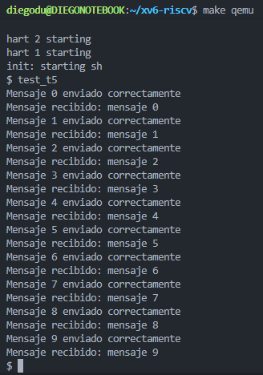
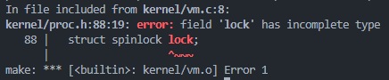
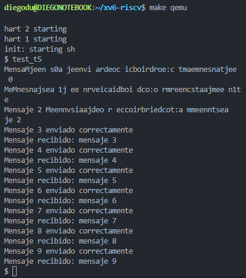
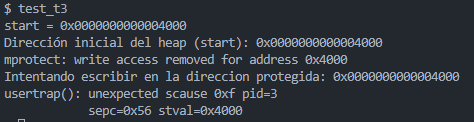

# Informe Tarea 3
## Pasos Seguidos
### 1. Creación Rama

En un primer lugar se verifican todas las ramas con el comando `git branch`, me percato que actualmente me encuentro en diego_duhalde_t2, cambio a la rama principal llamada riscv con el comando `git checkout riscv` y desde esa rama “limpia” creo la nueva rama diego_duhalde_t2 con el comando `git checkout -b diego_duhalde_t3`.

### 2. Modificación Archivo `proc.h`

Dentro de este archivo, el único cambio realizado es agregar `#include "spinlock.h"` en la primera linea del archivo, ya que con esto nos evitamos algunos errores de lock que ocurrían al momento de desarrollar la tarea.

### 3. Modificación Archivo `spinlock.h`

Al igual que para el archivo proc.h, se realizan cambios para evitar algunos problemas relacionados con el lock, se incluye al inicio las siguientes lineas, `#ifndef SPINLOCK_H` y `#define SPINLOCK_H`. Para el mismo cometido se agrega `#endif` al final del archivo.

### 4. Modificación Archivo `defs.h`

Siguiendo las especificaciones de la tarea entregada por el profesor, se agrega lo siguiente para definir las dos funciones a implementar.

```
// tarea 3
int             mprotect(void *addr, int len);
int             munprotect(void *addr, int len);
```

### 5. Modificación Archivo `trap.c`

Dentro de la función usertrap(void) que se encuentra dentro del archivo, se agrega el siguiente código para manejar las excepciones con respecto a la memoria de las funcionalidades nuevas implementadas. Ya que si deseamos escribir en una memoria protegida el programa termina, con este código hace que pueda continuar en ejecución.

```
else if(r_scause() == 0xf){
    printf("No se puede escribir en 0x%lx, porque se encuentra protegido\n", r_stval());
    p->trapframe->epc += 4;
  }
```

### 6. Modificación Archivo `vm.c`

Este se podría decir que es el archivo más importante, puesto que contiene toda la lógica nueva de la implementación de `mprotect` y `munprotect`, el código nuevo es el que se va a añadir a continución, si bien está levemente comentado voy a explicarlo de manera general. Ambas funciones incluyen los manejos a errores respectivos, primero revisan que len sea válido (mayor a 0) y que no se pase de los límites del tamaño del proceso, luego se verifica que se encuentre alineado, ocupando el módulo de la división para esto. Luego recorre las páginas y verifica que se avanzó correctamente en la página, que la página sea válida y que sea una página de usuario (Si alguna de estas no se cumple se retorna -1 y se sale forzadamente de la función (manejo de errores)), por último si todo lo demás se pasa sin ningún error cambia el estado de la escritura, para mprotect se deshabilita la escritura y para munprotect se habilita la escritura.

```
// tarea 3
int
mprotect(void *addr, int len) {
    struct proc *p = myproc();
    pte_t *pte;
    uint64 i;

    // Verificar longitud inválida y que no se pase del tamaño del proceso
    if (len <= 0 || (uint64)addr >= p->sz || (uint64)addr + len * PGSIZE > p->sz) {
        printf("mprotect: wrong length\n");
        return -1;
    }

    // Verificar que la dirección está alineada a página
    if ((uint64)addr % PGSIZE != 0) {
        printf("mprotect: wrong address alignment\n");
        return -1;
    }

    // Recorrer las páginas y cambiar los permisos
    for (i = PGROUNDDOWN((uint64)addr); i < (uint64)addr + len * PGSIZE; i += PGSIZE) {
        // Encontrar la PTE
        pte = walk(p->pagetable, i, 0);

        // Verificar que se realizó correctamente el walk
        if (pte == 0) {
            printf("mprotect: walk failed\n");
            return -1;
        }

        // Verificar que la página es válida
        if ((*pte & PTE_V) == 0) {
            printf("mprotect: invalid entry\n");
            return -1;
        }

        // Verificar que la página es de usuario
        if ((*pte & PTE_U) == 0) {
            printf("mprotect: not user page\n");
            return -1;
        }
        // Deshabilitar el permiso de escritura
        *pte &= ~PTE_W;
        printf("mprotect: write access removed for address 0x%lx\n", i);
    }

    // Invalidar TLB para que el cambio de permisos sea efectivo
    sfence_vma();
    return 0;
}


int
munprotect(void *addr, int len)
{
    struct proc *p = myproc();
    pte_t *pte;
    uint64 i;

    // Verificar longitud inválida y que no se pase del tamaño del proceso
    if (len <= 0 || (uint64)addr + len * PGSIZE > p->sz) {
        printf("munprotect: wrong length\n");
        return -1;
    }

    // Verificar que la dirección está alineada a página
    if ((uint64)addr % PGSIZE != 0) {
        printf("munprotect: wrong address alignment\n");
        return -1;
    }

    // Recorrer las páginas y cambiar los permisos
    for (i = PGROUNDDOWN((uint64) addr); i < ((uint64) addr + (len) * PGSIZE); i += PGSIZE) {
        // Encontrar la PTE
        pte = walk(p->pagetable, (uint64) i, 0);

        // Verificar que se realizó correctamente el walk
        if (pte == 0) {
            printf("munprotect: walk failed\n");
            return -1;
        }

        // Verificar que la página es válida
        if ((*pte & PTE_V) == 0) {
            printf("munprotect: invalid entry\n");
            return -1;
        }

        // Verificar que la página es de usuario
        if ((*pte & PTE_U) == 0) {
            printf("munprotect: not user page\n");
            return -1;
        }
        // Habilitar el permiso de escritura
        *pte |= PTE_W;
        printf("munprotect: write access allowed for address 0x%lx\n", i);
    }

    // Invalidar TLB para que el cambio de permisos sea efectivo
    sfence_vma();
    return 0;
}
```

### 7. Ajustes Extras

Como ya se realizó en la tarea 1, cuando se implementan funcionalidades hay que modificar varios archivos que las involucran para que se ejecuten correctamente.

* Dentro de la carpeta `kernel` tal como se hizo en la tarea cambiando principalmente los nombres, es necesario agregar llamadas a los archivos `syscall.h`, `syscall.c` y `sysproc.c`.

Archivo `syscall.h`

    #define SYS_getpriority 22
    #define SYS_getboost 23

Archivo `syscall.c`

    extern uint64 sys_mprotect(void);
    extern uint64 sys_munprotect(void);
    ...
    [SYS_mprotect] sys_mprotect,
    [SYS_munprotect] sys_munprotect,

Archivo `sysproc.c`

    // tarea 3
    uint64
    sys_mprotect(void)
    {
    int d;
    int n;
    argint(0, &d);
    argint(1, &n);
    if (d == 0 || n == 0)
        return -1;

    return mprotect((void *)(uintptr_t)d, n);
    }

    uint64
    sys_munprotect(void)
    {
    int d;
    int n;
    argint(0, &d);
    argint(1, &n);
    if (d == 0 || n == 0)
        return -1;

    return munprotect((void *)(uintptr_t)d, n);
    }

* Dentro de la carpeta `user`, específicamente del archivo `user.h` se añade lo siguiente

```
// tarea 3
int mprotect(void *addr, int len);
int munprotect(void *addr, int len);
```

* Finalmente, dentro del archivo `usys.pl` se agregan las siguientes líneas

```
# tarea 3
entry("mprotect");
entry("munprotect");
```

### 8. Programa de Prueba

- #### Creación Archivo de Pruebas
    Se crea el archivo de prueba llamado `test_t3.c`, para realizar todos los test especificados en el enunciado de la tarea. Este archivo debe estar ubicado dentro de la carpeta `user`.
- #### Lógica Programa de Pruebas
    - Primero se llama todo lo necesario para la ejecución del programa, esto vendría siendo las primeras 4 líneas del código.
    - Luego se añade la lógica del `main`, en una primera instancia se consigue la dirección del heap y se solicita una nueva página, para luego ejecutar la protección de la página de memoria, se intenta escribir en la página de memoria y se muestran resultados, para luego desproteger la memoria, se vuelve a intentar escribir y se muestran los resultados.
    ```
    #include "kernel/types.h"
    #include "kernel/stat.h"
    #include "user/user.h"
    #include "kernel/riscv.h"


    int main()
    {
    // Obtener la dirección inicial del heap
    char *start = sbrk(0);
    printf("Se define start = %p\n", start);
    // Solicitar una página de memoria
    sbrk(PGSIZE);
    // Obtener la dirección inicial del heap
    printf("Dirección inicial del heap (start): %p\n", start);
    // Proteger la página de memoria
    if (mprotect(start, 1) == -1)
    {
        printf("mprotect failed\n");
        return -1;
    }
    // Intentar escribir en la página de memoria protegida
    printf("Intentando escribir en la dirección protegida: %p\n", start);
    char *end = start;
    *end = 'a';
    printf("Valor al escribir: %p\n", end);
    // Desproteger la página de memoria
    printf("unprotecting the address: %p\n", start);
    if (munprotect(start, 1) == -1)
    {
        printf("munprotect failed\n");
        return -1;
    }
    // Intentar escribir en la página de memoria desprotegida
    printf("Intentando escribir en la dirección desprotegida: %p\n", start);
    *end = 'b';
    printf("Valor al escribir: %s\n", end);
    return 0;
    }
    ```

- #### Ajuste `Makefile`

    Finalmente, para que se pueda ejecutar el programa de pruebas es necesario añadir su llamada al archivo de `Makefile`, ya que si no se realiza este paso aunque el archivo como tal exista el SO no lo va a reconocer como tal. Siguiendo la misma lógica que en la tarea 1, se añade `$U/_test_t3\` en la línea 142.

## Pruebas Realizadas

Para las pruebas se ejecuta el comando `make clean` para poder evitar algunos errores que pueden haber aparecido luego de las ediciones de los archivos, luego se ejecuta xv6-riscv con `make qemu` y se realiza el llamado al programa de pruebas creado para esta tarea, utilizando `test_t3`.

El output obtenido es:



En donde se ve que al quitar el acceso a escritura el valor no cambia (presente en la línea 6: `Valor al escribir: 0x0000000000004000`), pero luego de permitir la escritura el valor efectivamente cambia y se vuelve b (`Valor al escribir: b` (última línea del output)), el cual es el comportamiento esperado de `mprotect` y `munprotect`.

## Dificultas encontradas y soluciones implementadas

Al ya haber existido tres entregas previas a esta tarea, todo el desarrollo fue más simple, ya que muchas cosas necesarias para implementar una funcionalidad fueron ya vistas para la tarea anterior y la tarea actual requería solo cambiar un poco la lógica de la anterior, igualmente se encontraron algunas dificultades:

### 1. Error de lock

Al estar implementando las nuevas funcionalidades empezó a salir un error de lock, lo que no hacia sentido, ya que era algo que no había tocado para la tarea, finalmente lo pude solucionar agregando lo del punto 2 y 3 del paso a paso.

Foto del error mostrado en consola al hacer `make qemu`:



### 2. Código programa de prueba

En un principio pensaba trabajar solo con el archivo de pruebas entregado por el profesor, pero con él no se podía visualizar completamente el funcionamiento de las implementación, aparte de tener generar errores, ya que algunas variables se me printeaban directamente como `c%` por ejemplo y no la variable como tal, decido implementar un nuevo programa de pruebas que es el actual.

### 3. Error al hacer make qemu por el README

Le cambie la extensión al archivo README y le agregue él .md para quedar `README.md` y que github lo agregara mostrando el formato, esto genero un error, ya que al parecer se requiere si o si el README sin extensión para la ejecución de xv6-riscv, por lo que mientras necesite ejecutarlo lo mantendré sin extensión y solo llamándose `README`.

Foto error:



### 4. Error base al intentar escribir en memoria protegida

Al principio con el archivo de pruebas siempre me tiraba el error y pensaba que era problema mío, pero luego entendí que está bien que arroje ese error al intentar escribir en la memoria protegida y realice ajustes del punto número 5, en el cual se añade la excepción para que no arroje error y termine inesperadamente.


