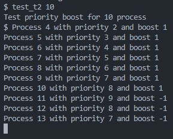

# Informe Tarea 2
## Pasos Seguidos
### 1. Creación Rama

En un primer lugar se verifican todas las ramas con el comando `git branch`, me percato que actualmente me encuentro en diego_duhalde_t1, cambio a la rama principal llamada riscv con el comando `git checkout riscv` y desde esa rama “limpia” creo la nueva rama diego_duhalde_t2 con el comando `git checkout -b diego_duhalde_t2`.

### 2. Modificación Archivo `proc.h` (Incorporación Prioridad y Boost)

Dentro del `struct proc` ubicado desde la línea 85 del archivo, se añade tanto la definición de priority como boost, ambos del tipo `int`.

```
int priority;                // Priority of the process
int boost;                   // Boost of the process
```

### 3. Modificación Archivo `proc.c` (Iniciación y Lógica de Prioridad y Boost)

#### Iniciación

Dentro de `allocproc(void)` ubicado desde la línea 110 del archivo, se inicia la prioridad y el boost, ambos con valores 0 y 1 respectivamente, tal como se especifica en el enunciado de la tarea.

```
// Set the priority and boost of the process
p->priority = 0; // default priority
p->boost = 1; // default boost
```

#### Lógica

Dentro de `scheduler(void)` ubicado desde la línea 449 del archivo, se implementa toda la lógica requerida para el funcionamiento correcto de la prioridad y el boost, cumpliendo con las 3 reglas mencionadas en el enunciado, `prioridad += boost`, si la prioridad alcanza el valor 9 el boost se actualiza a -1 y si la prioridad alcanza el valor 0 el boost cambia a 1.

```
// Regla 1
p->priority += p->boost; // increase the priority of the process

// Regla 2
if (p->priority >= 9) { // if the priority is greater than or equal to 9
    p->boost = -1; // set the boost to -1
}

// Regla 3
if (p->priority <= 0) { // if the priority is less than or equal to 0
    p->boost = 1; // set the boost to 1
}
```

### 4. Ajustes Extras

Como ya se realizó en la tarea 1, cuando se implementan funcionalidades hay que modificar varios archivos que las involucran para que se ejecuten correctamente.

* Dentro de la carpeta `kernel` tal como se hizo en la tarea cambiando principalmente los nombres, es necesario agregar llamadas a los archivos `syscall.h`, `syscall.c` y `sysproc.c`.

Archivo `syscall.h`

    #define SYS_getpriority 22
    #define SYS_getboost 23

Archivo `syscall.c`

    extern uint64 sys_getpriority(void);
    extern uint64 sys_getboost(void);
    ...
    [SYS_getpriority] sys_getpriority,
    [SYS_getboost] sys_getboost,

Archivo `sysproc.c`

    uint64
    sys_getpriority(void)
    {
    return myproc()->priority;
    }

    uint64
    sys_getboost(void)
    {
    return myproc()->boost;
    }

* Dentro de la carpeta `user`, específicamente del archivo `user.h` se añade lo siguiente

```
int getpriority(void);
int getboost(void);
```

* Finalmente, dentro del archivo `usys.pl` se agregan las siguientes líneas

```
entry("getpriority");
entry("getboost");
```

### 5. Programa de Prueba

- #### Creación Archivo de Pruebas
    Se crea el archivo de prueba llamado `test_t2.c`, para realizar todos los test especificados en el enunciado de la tarea. Este archivo debe estar ubicado dentro de la carpeta `user`.
- #### Lógica Programa de Pruebas
    - Primero se llama todo lo necesario para la ejecución del programa, esto vendría siendo las primeras 3 líneas del código.
    - Luego se añade de la lógica del `main` (parte inferior del código), la cual tiene que recibir 2 argumentos (tanto el nombre del programa como en número de procesos para el test), si por alguna razón es distinto a 2, printea el error y termina el programa, si se ejecuta en el formato correcto corre las pruebas.
    - Finalmente, se implementa la lógica de `test_priority_boost`, en la cual se recorre un ciclo for y para cada iteración se realiza `fork()`, si se realiza correctamente se printea información clave del fork en cada iteración, como el ID, la prioridad y el boost. Luego se hace un `sleep()` para la correcta ejecucion del programa.
     ```
    #include "kernel/types.h"
    #include "kernel/stat.h"
    #include "user/user.h"

    void test_priority_boost(int processes) {
        // Create the number of processes specified
        for (int i = 0; i < processes; i++) {
            // Create a new process
            int pid = fork();
            // Check if the process is the child
            if (pid == 0) {
                sleep(i+1);
                printf("Process %d with priority %d and boost %d\n", getpid(), getpriority(), getboost());
                exit(0);
            }
        }
    }

    int main(int argc, char *argv[]) {
        // Check the number of arguments
        if (argc != 2) { // 2 arguments: the program name and the number of processes
            // In case of wrong number of arguments, print the usage of the program
            printf("Usage: %s <number_of_processes>\n", argv[0]);
            exit(1);
        } else {
            printf("Test priority boost for %d process\n", atoi(argv[1]));
            test_priority_boost(atoi(argv[1]));
            exit(0);
        }
    }
    ```

- #### Ajuste `Makefile`

    Finalmente, para que se pueda ejecutar el programa de pruebas es necesario añadir su llamada al archivo de `Makefile`, ya que si no se realiza este paso aunque el archivo como tal exista el SO no lo va a reconocer como tal. Siguiendo la misma lógica que en la tarea 1, se añade `$U/_test_t2\` en la línea 142.

## Pruebas Realizadas

Para las pruebas se ejecuta xv6-riscv con el comando `make qemu` y se realiza el llamado al programa de pruebas creado para esta tarea, utilizando `test_t2 20`.


En la ejecución se puede apreciar el comportamiento esperado de la implementación de priority y boost, al llegar a prioridad 9 se actualiza el boost de 1 a -1, luego al llegar a prioridad 0 se cambia el boost de -1 a 1.

El programa al estar creado se puede ejecutar con más números de procesos como argumento, pero 20 es un número adecuado para poder visualizar los cambios al alcanzar 9 y 0 de prioridad.

Otro ejemplo puede ser para `test_t2 10`, con el cual se puede ver la regla implementada al alcanzar la priority 9 el boost cambia a -1, pero no se alcanza a notar cuando la priority alcanza 0.



Finalmente, si ejecutamos la función sin argumentos, nos muestra el uso correcto de la función, que vendría siendo `test_t2 <number_of_processes>`.


## Dificultas encontradas y soluciones implementadas

Al ya haber existido dos entregas previas a esta tarea, todo el desarrollo fue más simple, ya que muchas cosas necesarias para implementar una funcionalidad fueron ya vistas para la tarea anterior y la tarea actual requería solo cambiar un poco la lógica de la anterior, igualmente se encontraron algunas dificultades:

### 1. Prints desordenados y sin lógica

Uno de los problemas encontrados fue encontrado al momento de realizar las pruebas, cuando se ejecutaba el programa los prints resultantes se sobre escribían y mostraban todo desordenado, esto se solucionó cambiando la posición del sleep() a antes del print, ya que al ponerlo despúes se mostraba como en la imagen adjunta.


### 2. Formato de las variables al realizar print

Un error más básico y propio de la sintaxis de C, el cual pude solucionar de manera fácil fue al definir los prints que incluyen variables, por lógica tenía entendido que `%s` se utiliza para mostrar variables de tipo `string` y `%i` para variables tipo `int`, por lo que procedi a utilizar `%i` para todo (ya que valores como priority y boost son numéricos), pero se ejecutó con error, buscando rápido en internet pude encontrar que se ocupa `%d` y lo corregí rápidamente.

### 3. Código programa de prueba

En un principio todo el código de la lógica de ejecución lo estaba conteniendo directamente en el `main()` del programa de pruebas, pero por alguna razón me tiraba algunos errores y no se ejecutaba de forma correcta, por lo que decidí crear una función auxiliar llamada `test_priority_boost()` que se encargue de toda la lógica de los pínteos y que el `main()` solo maneje el argumento recibido y llame a la función auxiliar.